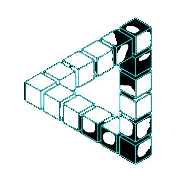

<h1 align="center">Hi 👋, I'm Soy Vitou Pro</h1>

<h3 align="center">A passionate on Machine learning and Computer Graphic from Cambodia</h3>

  

- 🔭 I’m currently working on [Animal Recognition](https://animal-recognition.streamlit.app/)

- 🌱 I’m currently learning **Python, Flask, JavaScript, React, etc...**

- 👯 I’m looking to collaborate on **Machine Learning**

- 💬 Ask me about **Python, Unity**

- 📫 How to reach me **Soy vitou Pro**

- ⚡ Fun fact **I think I am funny**

 

#

<h3 align="left">Connect with me:</h3>

 

#

### 🏆 My Real Color

 

#

<h3 align="left">Languages and Tools:</h3>

                                              

 

#

### 📊 Stats and Contributions

  
  

